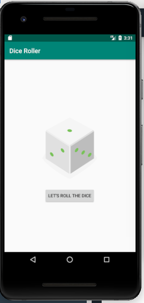

# Dice Roller

First Android app! A simple dice roller app.

Concepts learnt:
- setting up Android Studio and development environment for Android and Kotlin dev
- Basic XML for layouts.
- get view elements using the `findViewById` method.
- Adding interactivity to Button Element.
- Dynamically change resource and TextView content.
- Building the application.

## Setting up
- Clone/download/ repository.
- Open the project with Android Studio.
- Let the project sync and finish without errors.
- Run the application on Emulator(setup emulator from `Tools > AVD Manager`) or a Physical device.

